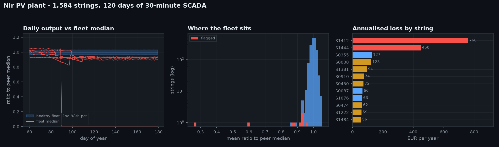
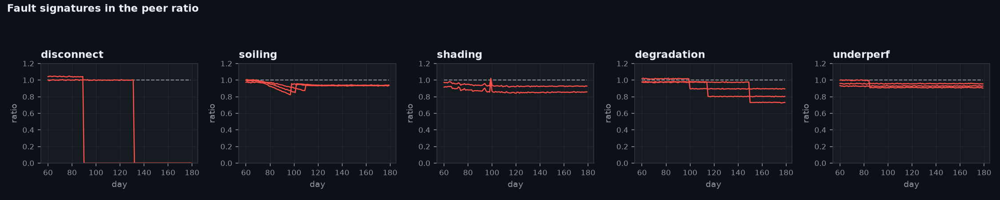

# PV String Fault Detection

Finding the underperforming strings in a 10 MW solar plant from SCADA data, and
ranking them by what they cost per year.



## The problem

A utility PV plant has thousands of strings and one maintenance crew. Output drifts
down over a season and nobody can say which strings are responsible: a disconnected
string is obvious, but a string running 7% low is worth real money and is invisible
on a plant-level dashboard.

Absolute thresholds do not survive contact with a real site. Performance ratio moves
with season, temperature and soiling, so a threshold tight enough to catch a 7% loss
in June raises hundreds of alarms in December.

## The approach

Peer comparison. All 1,584 strings on one site see nearly the same weather, so each
string is measured against the *fleet median for that day*. Season and temperature
affect numerator and denominator together and cancel out. A healthy string sits at
1.0 all year; a faulted one separates from the pack.

Four detectors, each aimed at a signature:

| Detector | Signature | Catches |
|---|---|---|
| `zero_output` | consecutive days near zero while peers produce | disconnects, blown fuses |
| `peer_ratio` | persistent gap to fleet median, robust (MAD) z-score | shading, degradation, chronic underperformance |
| `trend` | negative Theil–Sen slope over the whole record | steady degradation |
| `windowed_trend` | worst 30-day rolling slope | soiling that rain partly resets |

`windowed_trend` exists because of a specific failure. Soiling accumulates for weeks
and is then largely washed off, so the slope *across the whole record* is nearly flat
even though the string lost real energy. Scanning shorter overlapping windows and
keeping the worst one lifted soiling recall from 1/4 to 4/4.

Theil–Sen rather than least squares throughout: a single overcast day is an outlier
that would drag an OLS slope around, and the median of pairwise slopes ignores it.

## Results

Scored against known injected faults over 120 days of 30-minute data:

```
precision            1.00      no healthy string was flagged
recall               0.93      13 of 14 injected faults found
f1                   0.96

by fault type:       disconnect    2/2
                     shading       2/2
                     degradation   3/3
                     soiling       4/4
                     underperf     2/3
```

The single miss is a 5% chronic underperformance on one string — below the
fleet's own manufacturing spread, so it cannot be separated from noise without
more than 120 days of data. That is a real limit of the method, not a tuning
problem, and pretending otherwise would be dishonest.

Output is a work order list ranked by annualised revenue loss, not an alarm feed:

```
     string  inverter                                  detector  annual_lost_kwh  annual_lost_eur
string_1412         9 peer_ratio + windowed_trend + zero_output           9496.9           759.75
string_1444         9 peer_ratio + windowed_trend + zero_output           5619.8           449.58
string_0355         3                                peer_ratio           1591.6           127.33
string_0008         1       peer_ratio + trend + windowed_trend           1534.4           122.75
```



## Running it

```bash
pip install -r requirements.txt

# simulate a plant, detect faults, score against ground truth, all in one
PYTHONPATH=src python -m pvfault.cli demo

# or in two steps
PYTHONPATH=src python -m pvfault.cli simulate --days 120 --out outputs
PYTHONPATH=src python -m pvfault.cli detect --scada outputs/scada.csv \
    --truth outputs/truth.csv --tariff 0.08

# regenerate the figures
PYTHONPATH=src python examples/make_figures.py

# tests
PYTHONPATH=src python tests/test_pvfault.py
```

Point `detect` at a real SCADA export with a `poa_wm2` column and one column per
string and it will run unchanged.

## What is real and what is synthetic

**Real:** the plant. Geometry comes from the design of the 10 MW Nir PV plant in
Yazd province, from the project profile I authored as R&D expert at Kish Solar
Trading Co. — 36,432 modules of 280 Wp, 1,584 strings, nine 1 MW central inverters,
20,465 MWh expected in year one at a performance ratio of 87%.

**Synthetic:** the SCADA. I hold no operational data from the site, so the time
series is simulated — solar geometry, a Haurwitz clear-sky model, Erbs diffuse
split, isotropic transposition to a 30° tilt, NOCT cell temperature, and an arid
cloud regime. Faults are then injected at known strings so the detector can be
*scored* rather than admired.

This is the honest way round. A detector demonstrated on data with no ground truth
proves nothing; one scored against injected faults states its precision and recall
and can be argued with.

## Layout

```
src/pvfault/
  plant.py        design spec, geometry, validation
  irradiance.py   solar position, clear sky, transposition, cell temperature
  simulate.py     SCADA generation and fault injection
  detect.py       the four detectors
  report.py       loss estimation, ranking, scoring
  plots.py        figures, dark and light
  cli.py          simulate / detect / demo
tests/            17 tests, no network, deterministic
examples/         figure regeneration
```

Dependencies are numpy, pandas and matplotlib. Solar position and the clear-sky
model are written out rather than pulled from pvlib, to keep the demonstrator
runnable anywhere; for production work against a real site I would use pvlib, which
handles the edge cases this does not.

## Licence

MIT.
